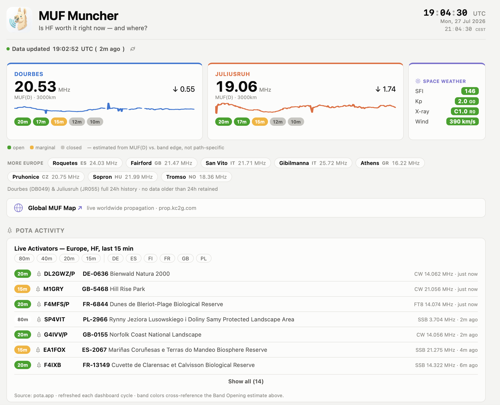
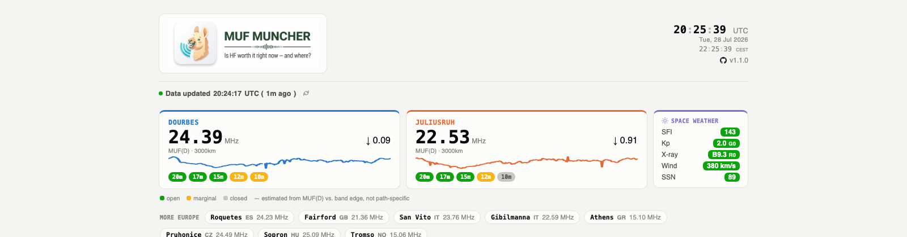
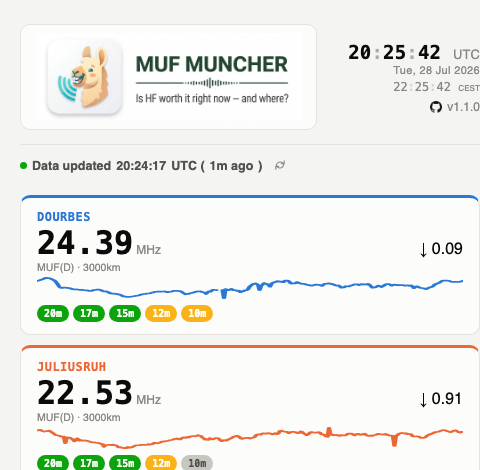
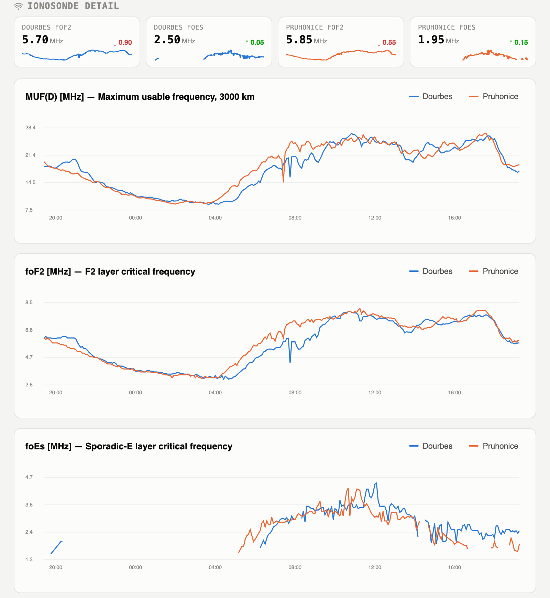
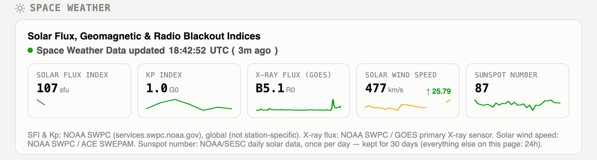

<p align="center">
  
</p>

<p align="center"><strong>v1.1.0</strong> &middot; <a href="https://github.com/mooxle/Muf_Muncher">GitHub</a></p>

> A self-hosted HF propagation dashboard for mid-Europe hams — MUF(D), foF2 and Sporadic-E from ten European ionosondes, full NOAA space weather (SFI, Kp, X-ray, solar wind), and live POTA activator spots, all cross-referenced into one glance-and-go page.

Every 15 minutes, a small Python script pulls ionosonde readings for Dourbes (Belgium) and Juliusruh (Germany) plus a ticker of 8 more European stations, NOAA's solar flux, K-index, GOES X-ray flux and ACE solar wind speed, and live POTA spots across Europe — then renders a dependency-free HTML dashboard (no build step, no framework, no external JS at runtime) that answers one question: **is HF worth it right now, and where?**



---

## Desktop &amp; Mobile

One template, no separate mobile build: the hero row and KPI grid reflow into a single column under 700px, and the reload button doubles as a manual pull-to-refresh once the page is added to the iOS home screen (see [Home screen ready](#what-it-shows) below). Click either preview for the full-length screenshot.

<table>
<tr>
<td width="70%" valign="top">
  <a href="MUF_Desktop.png"></a>
</td>
<td width="30%" valign="top">
  <a href="MUF_Mobile.png"></a>
</td>
</tr>
</table>

---

## Quick Start

### 1. Install the dependency

```bash
python3 -m venv .venv
source .venv/bin/activate
pip install -r requirements.txt
```

### 2. Run it

```bash
python3 muf.py
```

This fetches fresh data, writes `dashboard.html` (plus `muf.css`, `mufmuncher-icon.png`, and `muf_payload.json` next to it — see [How It Works](#how-it-works)), and (if you're running it in a real terminal) also prints an ASCII version of the charts straight to your console via [plotext](https://github.com/piccolomo/plotext).

The page fetches its data payload at load time, so opening `dashboard.html` directly from disk (`file://`) won't work — `fetch()` is blocked cross-origin for local files in every major browser. Serve the directory instead:

```bash
python3 -m http.server 8080
open http://localhost:8080/dashboard.html   # macOS
```

Prefer double-click-to-open over running a local server? Set `MUF_INLINE_PAYLOAD=1` and `muf.py` embeds the data directly in `dashboard.html` instead, so `file://` works again — at the cost of the reload-caching benefit described below.

```bash
MUF_INLINE_PAYLOAD=1 python3 muf.py
open dashboard.html   # macOS - works now, no server needed
```

### 3. Run it on a schedule

The dashboard is a static snapshot regenerated on every run — schedule it with cron (or see [Docker deployment](#docker-deployment) below for a containerized version with cron built in):

```cron
*/15 * * * * cd /path/to/muf-muncher && /path/to/.venv/bin/python3 muf.py >> muf.log 2>&1
```

---

## What It Shows

| Section | What it answers |
|---|---|
| **Hero row** | Current MUF(D) for each station + a green/yellow/gray chip per amateur band (20m–10m) estimating whether it's open right now, plus a square Space Weather glance tile (SFI/Kp/X-ray/wind, color-rated). All three tiles link down to their detail sections |
| **European Ticker** | Current MUF(D) for 8 more GIRO ionosonde stations across Europe (Spain, UK, Italy ×2, Greece, Czechia, Hungary, Norway) as compact pill chips — coverage without the chart overhead |
| **Global MUF Map** | One-click link out to [prop.kc2g.com](https://prop.kc2g.com)'s live, globally-interpolated MUF map |
| **Activator Activity** | Live POTA *and* SOTA activator spots across Europe on HF bands, merged into one time-sorted list and band-colored using the *same* MUF-derived open/marginal/closed logic as the hero row. Click a network, band, or country chip to filter (multi-select), list caps at 7 rows with a "Show all" expander |
| **Ionosonde detail** | foF2, MUF(D) and foEs charts for both hero stations, last 24h, with hover tooltips and a per-station legend toggle |
| **Space Weather** | SFI, Kp (+ G-scale), GOES X-ray flux (+ flare class and R-scale), ACE solar wind speed, and daily sunspot number (SSN) — each with its own tile, sparkline, and a color rating (good/marginal/critical) for HF conditions |
| **Home screen ready** | A reload button and a manual pull-to-refresh gesture, since iOS strips native pull-to-refresh once the page is added to the home screen as a standalone web app |





---

## Data Sources & API Calls

Everything below is a plain HTTP GET against a public, keyless API — no accounts, no API tokens, no auth headers required to fetch the raw data.

### 1. Ionosonde data — Lowell GIRO Data Center (DIDBase)

```
GET https://lgdc.uml.edu/fastchar/getbest
    ?ursiCode=DB049
    &charName=foF2,MUF(D),foEs
    &fromDate=2026/07/23 10:00:00
    &toDate=2026/07/24 10:00:00
```

`ursiCode` is the ionosonde station (`DB049` = Dourbes, `JR055` = Juliusruh).

The block above is a readable illustration of the request, not something you can paste directly into a shell — the parentheses in `MUF(D)` and the space in the date are shell-special characters. To actually try it, let `curl --data-urlencode` handle the escaping instead of doing it by hand:

```bash
curl -A "MufMuncher/1.1.0 (+https://github.com/mooxle/Muf_Muncher)" -G "https://lgdc.uml.edu/fastchar/getbest" \
  --data-urlencode "ursiCode=DB049" \
  --data-urlencode "charName=foF2,MUF(D),foEs" \
  --data-urlencode "fromDate=2026/07/23 10:00:00" \
  --data-urlencode "toDate=2026/07/24 10:00:00"
```

`muf.py` sends this same self-identifying `User-Agent` on every request to every source (GIRO, NOAA, POTA) rather than spoofing a browser — it turns out not to be required for a response, but it's the more transparent, identifiable way for an automated client to behave. Response is a commented, whitespace-delimited text table:

```
# Global Ionospheric Radio Observatory (GIRO)
# GIRO Digital Ionogram Database (DIDBase)
# ...
# Time                    CS   foF2 QD MUF(D) QD  foEs QD
2026-07-24T12:55:00.000Z   0    --- __    --- __  9.60 //
2026-07-24T13:00:01.000Z   0    --- __    --- __  9.10 //
2026-07-24T13:05:02.000Z  95   6.150 //  20.491 //  --- __
```

Note the `---` values: during strong Sporadic-E, the F2-layer trace can be unscoreable at that exact timestamp even though foEs is readable — `muf.py` treats these as `null` rather than crashing or inventing a number, and the dashboard draws a real gap in the line rather than pretending the data exists.

### 2. Space weather — NOAA SWPC

```
GET https://services.swpc.noaa.gov/products/noaa-planetary-k-index.json
```

```json
[
  {"time_tag": "2026-07-24T09:00:00", "Kp": 1.67, "a_running": 6, "station_count": 8}
]
```

```
GET https://services.swpc.noaa.gov/json/f107_cm_flux.json
```

```json
[
  {"time_tag": "2026-07-23T22:00:00", "frequency": 2800, "flux": 148.0}
]
```

```
GET https://services.swpc.noaa.gov/json/goes/primary/xrays-6-hour.json
```

```json
[
  {"time_tag": "2026-07-27T18:13:00Z", "satellite": 18, "flux": 1.03e-06, "energy": "0.1-0.8nm"}
]
```

Only the `"0.1-0.8nm"` (long-channel) entries are kept — that's the standard input for A/B/C/M/X flare classification and NOAA's R-scale (radio blackout) rating, both computed client-side in the dashboard from this raw flux.

```
GET https://services.swpc.noaa.gov/json/ace/swepam/ace_swepam_1h.json
```

```json
[
  {"time_tag": "2026-07-27T16:00:00", "dsflag": 0, "dens": 2.99, "speed": 401.27, "temperature": 22413.16}
]
```

Rows with `dsflag != 0` (bad/interpolated readings) are dropped.

```
GET https://services.swpc.noaa.gov/text/daily-solar-indices.txt
```

```
2026 07 27  147     89      660      1    -999      *   6  1  0  2  0  0  0
```

A plain-text table (`Date, Radio Flux 10.7cm, SESC Sunspot Number, ...`), one row per day. Unlike everything else on this page, sunspot number only updates once a day and "today" isn't final until the day is over - the freshest usable reading is typically for yesterday.

### 3. Live POTA activator spots

```
GET https://api.pota.app/spot/activator
```

```json
{
  "spotId": 53949940,
  "activator": "W1AW/4",
  "frequency": "14074.0",
  "mode": "FT8",
  "reference": "US-2911",
  "name": "Sadlers Creek State Park",
  "spotTime": "2026-07-24T20:58:44",
  "latitude": 34.421,
  "longitude": -82.8188
}
```

This one returns *every* current spot worldwide, on every band and mode — `muf.py` does all the filtering (see [Current Limitations](#current-limitations-hardcoded-for-now) below).

### 4. Live SOTA activator spots

```
GET https://api-db2.sota.org.uk/api/spots/-1/all
```

```json
{
  "id": 358898,
  "timeStamp": "2026-07-28T18:17:48",
  "callsign": "DA1HM",
  "associationCode": "OE",
  "summitCode": "SB-289",
  "activatorCallsign": "OE/DA1HM/P",
  "activatorName": "Johann",
  "frequency": "14.31",
  "mode": "SSB",
  "summitDetails": "Heuberg, 901m, 2 points"
}
```

Also every current spot worldwide, all bands - `muf.py` filters to European `associationCode`s (a hardcoded list built from `GET https://api-db2.sota.org.uk/api/associations`, which tags each association with a `continent` field) and HF only. SOTA and POTA spots are merged into one list, sorted by time, with a `network` field ("POTA"/"SOTA") on each entry so the dashboard can tag, filter, and link each row appropriately (POTA links to pota.app, SOTA to [sotl.as](https://sotl.as)).

---

## How It Works

```
muf.py (runs every 15 min via cron)
  ├─ fetch_station()      → GIRO/DIDBase, per hero station, last 24h
  ├─ fetch_ticker_value()  → GIRO/DIDBase, per ticker station, latest MUF(D) only
  ├─ fetch_kindex()        → NOAA K-index
  ├─ fetch_sfi()            → NOAA solar flux
  ├─ fetch_xray()           → NOAA / GOES X-ray flux, last 6h
  ├─ fetch_solar_wind()     → NOAA / ACE SWEPAM solar wind speed, hourly
  ├─ fetch_ssn()             → NOAA/SESC sunspot number, daily, kept 30 days
  ├─ fetch_pota_spots()      → POTA spots, filtered (Europe / HF / last 15min)
  ├─ fetch_sota_spots()       → SOTA spots, filtered (Europe / HF / last 60min),
  │                            merged with POTA spots into one time-sorted list
  │
  ├─ merge_and_prune()     → dedupe by timestamp against muf_data.json,
  │                           drop anything older than 24h
  ├─ render_html()          → copies dashboard_template.html verbatim to dashboard.html
  │                           (+ index.html, muf/index.html), writes the merged JSON to
  │                           muf_payload.json, and copies muf.css + mufmuncher-icon.png +
  │                           mufmuncher-banner.png alongside every one of them
  └─ render_summary()       → a small flat summary.json (latest values only),
                              for external dashboards (e.g. gethomepage/homepage)
                              that can't index "the last item" of a variable-length array
```

The dashboard itself (`dashboard_template.html`) is intentionally dependency-free: no charting library, no npm, no build step. All the SVG line charts, the hover crosshair, the legend toggle, and the KPI tiles are vanilla JS drawing directly into `<svg>` elements.

**Static vs. dynamic, and why they're split into separate files:** `muf.css`, `mufmuncher-icon.png` and `mufmuncher-banner.png` never change between runs, so they're real static files the browser caches normally across reloads - earlier versions inlined the icon directly into the HTML (base64-encoded, ~30KB, and ended up embedded three times over via a template placeholder, since it's referenced by the favicon, apple-touch-icon, and header logo - all from one page's markup, not even across reloads). The banner replaces the icon+wordmark as the header logo in light mode; since it's a flat white asset with no transparency, dark mode (`prefers-color-scheme`) swaps back to the icon and CSS-drawn wordmark instead of shipping a second banner image. `muf_payload.json` *does* change every cron cycle, so it's still re-fetched every load, but keeping it as its own file (rather than inlined as `const DATA = {...}`) means a browser reload within the same 15-minute window can still get a `304 Not Modified` instead of re-transferring the full payload - and the reload button / pull-to-refresh gesture make that a common case. The one trade-off: the page now needs a `fetch()` at load time, so it must be served over `http(s)://`, not opened directly via `file://` (see [Quick Start](#quick-start) for the `MUF_INLINE_PAYLOAD=1` escape hatch if you want `file://` back).

`muf_data.json` (the full 24h history) and `summary.json` (latest-values-only) are both written alongside the HTML, so you can point other tools at either depending on whether you need the history or just the current numbers.

---

## Current Limitations (hardcoded, for now)

This was built for one specific use case — mid-Europe HF conditions — and several things are deliberately fixed rather than configurable yet:

- **24h window, almost always.** `muf.py` requests the last 24 hours from GIRO and NOAA on every run, merges it with whatever's already in `muf_data.json`, and **permanently discards anything older than 24h** - with one exception: sunspot number (SSN) is a once-daily reading, so it's kept for 30 days instead (a 24h window would only ever hold a single point, no trend to show). There's no way to keep a longer history for the other metrics, or look further back, without changing the code.
- **Two hardcoded hero stations, plus 8 hardcoded ticker stations.** Dourbes (`DB049`) and Juliusruh (`JR055`) are set directly in `muf.py`'s `stations` dict; the ticker's 8 additional European stations live in `TICKER_STATIONS`/`TICKER_COUNTRY`. Adding or swapping a station means editing the script, not a config file.
- **POTA and SOTA are hardcoded to Europe + HF only, on different recency windows.** POTA uses a lat/lon bounding box (`lat 34–72, lon -25–40`) and a 15-minute cutoff; SOTA uses a hardcoded list of European `associationCode`s (`SOTA_EU_ASSOCIATIONS`) and a 60-minute cutoff, since summit spots stay "current" longer. Both share the same HF-only band filter (excluding 6m/VHF/UHF). None of this is a parameter yet.
- **Band-opening thresholds are fixed** to five bands (20m/17m/15m/12m/10m) with hand-picked representative frequencies — see `BANDS` in the template.

None of this is architecturally hard to fix — the obvious next step for a v2 would be pulling these into command-line flags or environment variables (station list, region bounding box, time windows, HF/VHF cutoff). It just hasn't been needed yet for a dashboard built around one specific pair of stations and one specific region.

---

## Docker Deployment

The included `Dockerfile` + `docker-compose.yml` run `muf.py` on a cron schedule inside a container and serve the output with Python's built-in `http.server` — genuinely minimal, no nginx, no app server:

```bash
docker compose up -d --build
```

- `entrypoint.sh` runs `muf.py` once immediately (so the dashboard isn't empty on first start), then starts cron (`muf-cron`, every 15 min) and the file server in one process.
- Output goes to `/data` (a named volume), which the file server serves directly — `dashboard.html`, `index.html`, `muf.css`, `mufmuncher-icon.png`, `mufmuncher-banner.png`, `muf_payload.json`, `muf_data.json`, and `summary.json` all end up there.
- If you put a reverse proxy in front (nginx, Nginx Proxy Manager, Caddy, ...) for TLS/auth, make sure whatever proxies `/your-path/` also forwards the exact sub-paths unstripped or stripped consistently — `muf.py` writes duplicate copies to a `muf/` subdirectory specifically to survive either proxy behavior without guessing wrong.

---

## Data Sources & Attribution

| Source | What for | License / Terms |
|---|---|---|
| [Lowell GIRO Data Center (LGDC) / DIDBase](https://giro.uml.edu/didbase/) | Ionosonde-derived foF2, MUF(D), foEs | [CC BY-NC-SA 4.0](https://giro.uml.edu/didbase/RulesOfTheRoad.html) — **non-commercial only**, attribution required |
| [NOAA Space Weather Prediction Center](https://www.swpc.noaa.gov/) | Solar flux index (SFI), planetary K-index, GOES X-ray flux, ACE solar wind speed, daily sunspot number | U.S. government work, public domain — attribution appreciated, no endorsement implied |
| [POTA (Parks on the Air)](https://parksontheair.com/) | Live activator spots | No formal API terms of service found; the public API is served with permissive CORS (`Access-Control-Allow-Origin: *`), suggesting open third-party use is intended, but this isn't a substitute for an actual published policy |
| [SOTA (Summits on the Air)](https://www.sota.org.uk/) | Live activator spots, association list | No formal API terms of service found for `api-db2.sota.org.uk` specifically; sota.org.uk's general site terms apply to the website itself |
| [prop.kc2g.com](https://prop.kc2g.com) (KC2G) | Linked out to, not embedded/scraped | Not redistributed by this project — see their site directly for terms |

### Required attribution for GIRO/DIDBase data

Per LGDC's Rules of the Road, any use should cite:

> Reinisch, B. W., and I. A. Galkin (2011), Global ionospheric radio observatory (GIRO), *Earth, Planets and Space*, 63, 377–381, doi:10.5047/eps.2011.03.001. See http://spase.info/SMWG/Observatory/GIRO

This citation is already included in the dashboard's footer — if you build on this code, keep it there or somewhere equally visible.

---

## Intended Use

This is a **private, personal, non-commercial** project.

Intended for:
- Checking HF band conditions for mid-Europe before getting on the air
- Personal or club use, self-hosted, low request volume (one fetch per 15 min)

Not intended for:
- Commercial use of the GIRO/DIDBase data specifically (explicitly excluded by its CC BY-NC-SA license)
- Bulk/automated scraping beyond the built-in 15-minute cadence
- Presenting this as an official NOAA, LGDC/GIRO, POTA, or SOTA product — it isn't, and no endorsement by any of them is implied

---

## Notes

- **Gap handling isn't "any missing sample = break the line."** A single missed autoscaling pass (common during Sporadic-E) doesn't fragment the chart — only a real time gap (>20 min) between two valid readings starts a new line segment. Applies identically to the web dashboard and the terminal chart.
- **Band-opening chips are a rough estimate**, not a propagation prediction: `MUF(D) ≥ band edge × 1.05` → open, `≥ × 0.85` → marginal, else closed. It's a single-station-overhead heuristic, not a path-specific forecast.
- **The QRZ/POTA.app links use a best-effort callsign parser** (strips `/P`, `/M`, `/MM`, `/AM`, `/QRP`, picks the longer half of prefix/call compounds like `LA/DC6ST` → `DC6ST`). Covers the common cases; unusual callsign formats can still slip through.

---

## Requirements

```
plotext
```

That's the entire runtime dependency list — everything else (HTTP requests, JSON, datetime handling) is Python standard library.

---

## 73 de [DA6MAX](https://www.qrz.com/db/DA6MAX)

<p align="center">
  <a href="https://www.qrz.com/db/DA6MAX"></a>
</p>

*Built to answer one question every morning: is it worth turning the radio on?*

---

## Thanks

Ullrich "Uz" von Bassewitz, [DF5WC](https://www.qrz.com/db/DF5WC), pointed out the shebang line and suggested splitting the static assets from the data payload for proper browser caching (see [How It Works](#how-it-works)) — both are in here because of that.

---

## Transparency

The idea and concept behind this tool were conceived by **Max Sammet (DA6MAX)**. The code was generated with the assistance of [Claude](https://www.anthropic.com/claude) by Anthropic.
